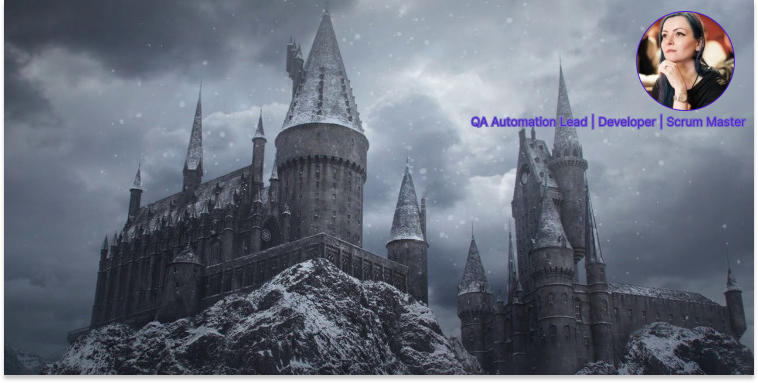

 <h1 align="center"> Hi, I am Viktoria </h1>

* 🎓 I graduated from [ITMO, Russia](https://en.itmo.ru/en/page/42/Facts_&_Figures.htm) University in 2013 and have a Master degree in Program engineering
* ⚡️I started my career as Java automation tester in 2011 and continue improving my automation skills (11 years) till now, comparing with the role of QA Lead (6 years)
* 🙋🏻‍ Had a period of 2 years of improving social skills and public performance 
as Certified Scrum Master (2 years) in Agile SAFe department of Deutsche Telekom and also  learned product development as Product Owner (half year) 
* 💻 ️Also did some Java microservice development and bug fixing in Agile team, as Scrum Master role did not take full time
* 🔎 Now I am interested in programming skills improvement, so I am learning Django Python, React, Kotlin, planning to have a look on Go maybe
* 💞️ I think the best variant of job for me is a mix of different roles in Agile Scrum team, mostly middle Fullstack developer and QA Automation tester roles, 
but I also like orderliness, so some org. staff is also nice for me

***
### ⚙ GitHub Analytics
<table style="width:100%">
  <tr>
       <td></td>
       <td></td>
</tr>
</table>

### 👩‍💻 Skills

<table style="width:100%">
  <tr>

- Languages: &nbsp;
  
  
  
  
  

- Frameworks: &nbsp;
  
  
  

- Databases:  &nbsp;
  
  
  
  
  

- IDEs: &nbsp;
  
  
  

</tr>
<tr>

- Test Design: &nbsp;
  
  
  

- Test Tools: &nbsp;
  
  
  
  
  
  
  
  
  

</tr>
<tr>

- CI/CD: &nbsp;
  
  
  
  

</tr>
<tr>

- Message Brokers:
  

</tr>
<tr>

- Task Tracker:
  
  
  
  
  

</tr>
<tr>

- OS:
  
  

</tr>
</table>

###  🎓 Certificates
* 
  ISTQB Tester Foundation Level (2018)
* <a href="https://www.scrum.org/user/589099">
Professional Scrum Master I (2019)</a>
* 
  Test Manager School (№ 21319, 2019)
* <a href="http://scr.istqb.org/?name=Mitrofanova">
  ISTQB Automation Tester Advanced Level (2021)</a>

### 🤍 Hobbies
* ⚕️ I am interested in medicine and veterinary, so I visit medical webinars from time to time just for myself and got Vet assistant certificate to take right care about my cat =)
* 🧚 ‍️Permanently try to read something interesting and learn something new in different spheres from programming to writing fairy tales =)
* ✈️ I like to travel, and I am fan of Thailand, nevertheless do not like sun =)
* 🏂   Doing snowboarding for already 5 years and also dreaming to visit Orlando Harry Potter village again, I am a real fan of this Universe =)
